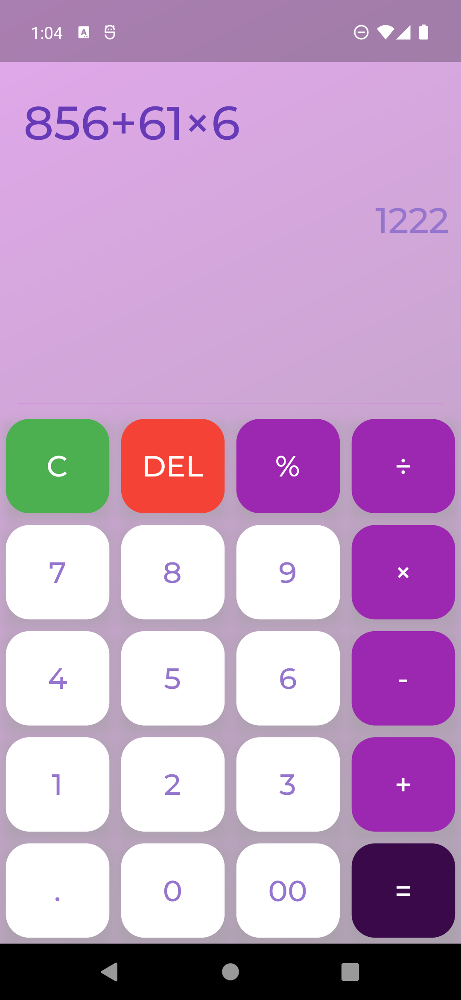

# Calculatrice en flutter

## Présentation

Voici ma première application en flutter.
Pour ce projet j'ai choisis de réaliser une calculatrice, puisque c'est un projet assez simple pour commencer à apprendre flutter.

**Voici le design de l'application**

## Explication

- Pour réaliser ce projet je me suis aidée de deux vidéos YouTube publié par [Technovore](https://www.youtube.com/c/Technovoreci/featured) pour avoir la base de l'application.

  Lien des vidéos :

  - [Première vidéo](https://youtu.be/iSGT2Qa8apo)
  - [Deuxième vidéo](https://youtu.be/ttHp1EL-iIM)

- Par la suite je me suis inspiré d'un post instagram pour modifier l'interface de l'application

  Lien du post : [codingzest](https://www.instagram.com/p/Ce_dtw0DcQv/?utm_source=ig_web_copy_link)

- Pour finir, j'ai apportées mes propres modifications pour améliorer cette calculatrice comme l'ajout d'animations ou une meilleure gestion des erreurs.

## Application

Voici le fichier APK pour installer l'application sur Android : [calculatrice.apk](app.apk)
